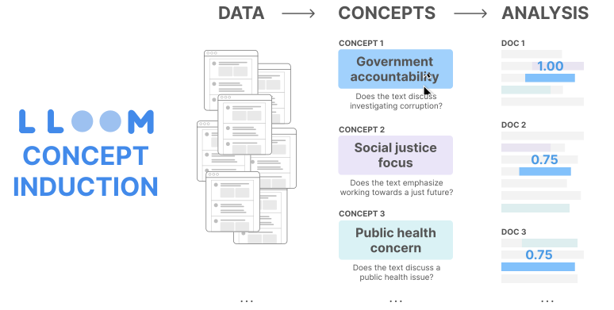

# LLooM

<p align="">
    <h3>
        <a href="https://stanfordhci.github.io/lloom/" target="_blank"><b>PROJECT PAGE</b></a> | 
        <a href="https://hci.stanford.edu/publications/2024/Lam_LLooM_CHI24.pdf" target="_blank">Paper</a> | 
        <a href="https://stanfordhci.github.io/lloom/examples/pol-soc-media.html" target="_blank">Demo Examples</a>
    </h3>
</p>
<p align="">
    <a target="_blank" href="https://colab.research.google.com/github/michelle123lam/lloom/blob/main/docs/public/nb/24_04_LLooM_GettingStartedTemplate_v2.ipynb">
        
    </a>&nbsp
    <a href="https://badge.fury.io/py/text_lloom"></a>
</p>

**LLooM** is an interactive text analysis tool introduced as part of an ACM CHI 2024 paper:

**Concept Induction: Analyzing Unstructured Text with High-Level Concepts Using LLooM**. *Michelle S. Lam, Janice Teoh, James Landay, Jeffrey Heer, Michael S. Bernstein*. Proceedings of the 2024 CHI Conference on Human Factors in Computing Systems (CHI '24).

<p align="center">

</p>

## What is LLooM?
LLooM is an **interactive data analysis tool** for **unstructured text** data, such as [social media posts](https://stanfordhci.github.io/lloom/examples/pol-soc-media.html), [paper abstracts](https://stanfordhci.github.io/lloom/examples/paper-abstracts.html), and [articles](https://stanfordhci.github.io/lloom/examples/ai-impact-statements.html). Manual text analysis is laborious and challenging to scale to large datasets, and automated approaches like topic modeling and clustering tend to focus on lower-level keywords that can be difficult for analysts to interpret.

By contrast, the LLooM algorithm turns unstructured text into meaningful **high-level concepts** that are defined by explicit inclusion criteria in **natural language**. For example, on a dataset of toxic online comments, while a BERTopic model outputs `"women, power, female"`, LLooM produces concepts such as `"Criticism of gender roles"` and `"Dismissal of women's concerns"`. We call this process **concept induction**: a computational process that produces high-level concepts from unstructured text.

The **LLooM Workbench** is an interactive text analysis tool that visualizes data in terms of the concepts that LLooM surfaces. With the LLooM Workbench, data analysts can inspect the automatically-generated concepts and author their own custom concepts to explore the data.

## What can I do with LLooM?
LLooM can assist with a range of data analysis goals—from **preliminary exploratory analysis** to **theory-driven confirmatory analysis**. Analysts can review LLooM concepts to interpret emergent trends in the data, but they can also author concepts to actively seek out certain phenomena in the data. Concepts can be compared with existing metadata or other concepts to perform **statistical analyses**, generate **plots**, or train a **model**.

<p align="center">

</p>

### Example notebooks
**Check out the [Examples](https://stanfordhci.github.io/lloom/examples/pol-soc-media.html) section** to walk through case studies using LLooM, including:
- 🇺🇸📱 Political social media: [Case Study](https://stanfordhci.github.io/lloom/examples/pol-soc-media.html) | [Colab NB](https://colab.research.google.com/drive/1VRpKTv8TLQdQSb3yPIm7EO_AmeaL5qa2?usp=sharing)
- 💬⚖️ Content moderation: [Case Study](https://stanfordhci.github.io/lloom/examples/content-mod.html) | [Colab NB](https://colab.research.google.com/drive/1kVgs-rhj83egnCdpEEfYcYJKzCGUGda8?usp=sharing)
- 📄📈 HCI paper abstracts: [Case Study](https://stanfordhci.github.io/lloom/examples/paper-abstracts.html) | [Colab NB](https://colab.research.google.com/drive/13K7yQML9jjWIofYSQYNWDtnWE9QJRZvE?usp=sharing)
- 📝🤖 AI ethics statements: [Case Study](https://stanfordhci.github.io/lloom/examples/ai-impact-statements.html) | [Colab NB](https://colab.research.google.com/drive/1CenVNlaTJWBdk3BOeKaL3jX4Y4sK3MrW?usp=sharing)


### Workbench visualization
<p align="center">

</p>

After running concept induction, the Workbench can display an interactive visualization like the one above. LLooM Workbench features include:
- **A: Concept Overview**: Displays an **overview** of the dataset in terms of concepts and their prevalence.
- **B: Concept Matrix**: Provides an **interactive summary** of the concepts. Users can click on concept rows to inspect concept details and associated examples. Aids comparison between concepts and other metadata columns with user-defined slice columns.
- **C: Detail View (for Concept or Slice)**:
  - **C1: Concept Details**: Includes concept information like the **Name**, **Inclusion criteria**, **Number of doc matches**, and **Representative examples**.
  - **C2: Concept Matches and Non-Matches**: Shows all **input documents** in **table** form. Includes the original text, bullet summaries, concept scores, highlighted text that exemplifies the concept, score rationale, and metadata columns.

## How does LLooM work?
LLooM is a **concept induction** algorithm that extracts and applies concepts to make sense of unstructured text datasets. LLooM leverages large language models (specifically GPT-3.5 and GPT-4 in the current implementation) to synthesize sampled text spans, generate concepts defined by explicit criteria, apply concepts back to data, and iteratively generalize to higher-level concepts.

<p align="center">

</p>

## Get Started
Follow the [**Get Started**](https://stanfordhci.github.io/lloom/about/get-started) instructions on our documentation for a walkthrough of the main LLooM functions to run on your own dataset. We suggest starting with this [template Colab Notebook](https://colab.research.google.com/github/michelle123lam/lloom/blob/main/docs/public/nb/24_04_LLooM_GettingStartedTemplate_v2.ipynb).

This will involve downloading our Python package, available on PyPI as [`text_lloom`](https://pypi.org/project/text_lloom/). We recommend setting up a virtual environment with [venv](https://docs.python.org/3/library/venv.html#creating-virtual-environments) or [conda](https://conda.io/projects/conda/en/latest/user-guide/tasks/manage-environments.html#creating-an-environment-with-commands).
```sh
pip install text_lloom
```

## Contact
LLooM is a research prototype and still under active development! Feel free to reach out to Michelle Lam at mlam4@cs.stanford.edu if you have questions, run into issues, or want to contribute.

## Citation
If you find this work useful to you, we'd appreciate you citing our paper!
```
@article{lam2024conceptInduction,
    author = {Lam, Michelle S. and Teoh, Janice and Landay, James and Heer, Jeffrey and Bernstein, Michael S.},
    title = {Concept Induction: Analyzing Unstructured Text with High-Level Concepts Using LLooM},
    year = {2024},
    isbn = {9798400703300},
    publisher = {Association for Computing Machinery},
    address = {New York, NY, USA},
    url = {https://doi.org/10.1145/3613904.3642830},
    doi = {10.1145/3613904.3642830},
    booktitle = {Proceedings of the 2024 CHI Conference on Human Factors in Computing Systems},
    articleno = {933},
    numpages = {28},
    location = {Honolulu, HI, USA},
    series = {CHI '24}
}
```
